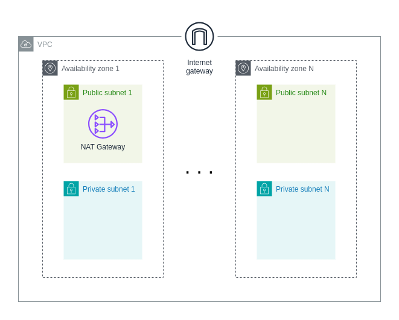

# VPC Module

This Terraform configuration sets up a Virtual Private Cloud with the following components:

- VPC: Creates a Virtual Private Cloud with a specified CIDR block.
- Subnets: Configures both public and private subnets within the VPC.
  - Public Subnets: Subnets that are accessible from the internet.
  - Private Subnets: Subnets that are isolated from the internet.
- Internet Gateway: Attaches an internet gateway to the VPC to enable internet access for public subnets.
- Public Route Table: Includes a route to the internet gateway for internet access.
- NAT Gateway: If set as true will allow outbound internet traffic to all Private Subnets.

### How to use

```js
module "vpc" {
  source = "git::https://github.com/nmema/terraform-baby-modules.git//services/vpc?ref=v0.0.4"

  aws_region = "us-west-2"

  vpc_cidr              = "10.0.0.0/16"
  public_subnets_cidrs  = ["10.0.1.0/24", "10.0.2.0/24"]
  private_subnets_cidrs = ["10.0.4.0/24", "10.0.5.0/24"]
  azs                   = ["us-west-2a", "us-west-2b"]

  prefix_name        = "Terraform"
  enable_nat_gateway = true
}
```


### Architecture
